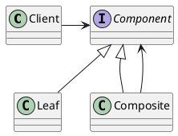
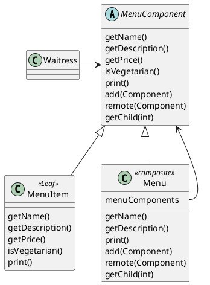

# Iterator Pattern
## Iterator를 도입함으로써
- Waitress는 menu가 어떤 구조로 코딩되어 있는지 알 필요가 없음.
- 반복되는 for loop을 제거
- 각 menu의 concrete class를 참조하고 있으므로 변경이 어려움
    - menu interface를 통일해야함

## menu interface 생성
- createIterator(): iterator 생성 메소드

## Iterator pattern
- 컬렉션 구현 방법을 노출하지 않으면서 컬렉션 내의 모든 객체에 접근할 수 있게 함.
- 컬렉션의 인터페이스 및 구현 간단해짐

## Iterator pattern만으로 구현할 수 없는 것
- menuItem에 subMenu를 추가해야 한다면? 어떻게 구현하고 iterate할 것인가
  - Composite pattern 이용

# Composite Pattern
객체들을 트리구조로 구성
<< general >>

<< menu >>
